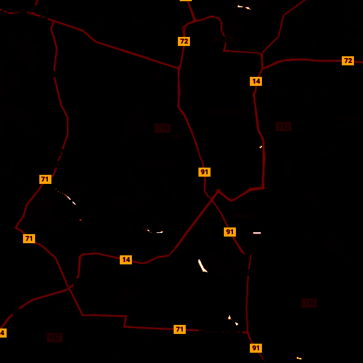
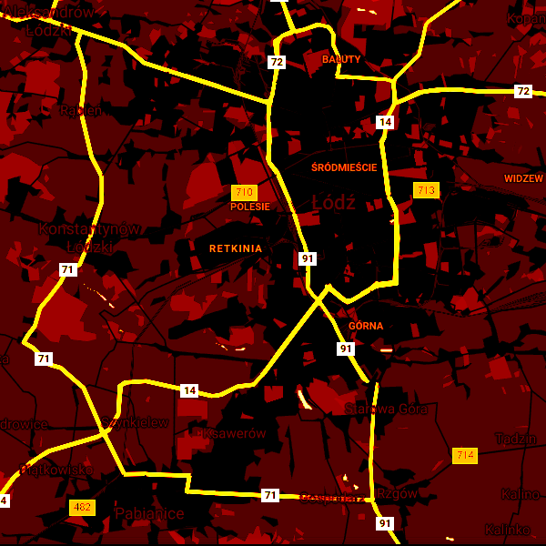

# colorimgdiff
[](https://travis-ci.com/Shot511/colorimgdiff) 
[](https://opensource.org/licenses/MIT)

An utility application to generate colored diff images (using colormaps) between reference and source images.

## How to build
Simply run Cmake:
```
mkdir build
cd build
cmake ..
[optional] cmake --build .
```

## How to use
Available supported commands are being shown after executing ```colorimgdiff -h```:

```
Creates diff image of ref(erence) and src (source) images.

Usage:
  colorimgdiff [OPTION...] <ref_image> <src_image>

  -o, --out arg       Relative path to output image WITHOUT extension (it'll
                      be a PNG image) (default: output_diff)
  -c, --colormap arg  Changes the default colormap. Possible options are:
                      Parula, Heat, Hot, Jet, Gray, Magma, Inferno, Plasma,
                      Viridis, Cividis, Github. (default: Hot)
  -m, --mode arg      Sets the comparison mode. Available options are: Luma,
                      Lab. (default: Luma)
  -v, --verbose       Verbose output
  -h, --help          Prints this message
```

Where <ref_image> and <src_image> are relative paths (with extensions) to reference and source images respectively.

## Available Colormaps
See [tinycolormap](https://github.com/yuki-koyama/tinycolormap) repo for available colormaps or simply run ```colorimgdiff -h```.

## How it works
1) It loads ref and src images.
2) Computes difference in luma or L\*a\*b\* space.
3) Maps difference to a color based on a chosen colormap.
4) Outputs diff image.
5) If ```--verbose``` option was active it also prints out MSE and RMSE (luma) or delta E (L\*a\*b\*).

## Example

| Ref | Src | Diff luma | Diff L\*a\*b\* |
|-----|-----|-----------|----------------|
|  |  |  |   RMSE: 0.0592 | Delta E: 15.118 |

## Dependencies
* [stb_image_write.h](https://github.com/nothings/stb) (PUBLIC DOMAIN)
* [stb_image.h](https://github.com/nothings/stb) (PUBLIC DOMAIN)
* [tinycolormap.hpp](https://github.com/yuki-koyama/tinycolormap) (MIT)
* [cxxopts.hpp](https://github.com/jarro2783/cxxopts) (MIT)

## Contribution
Pull requests are very welcome.
