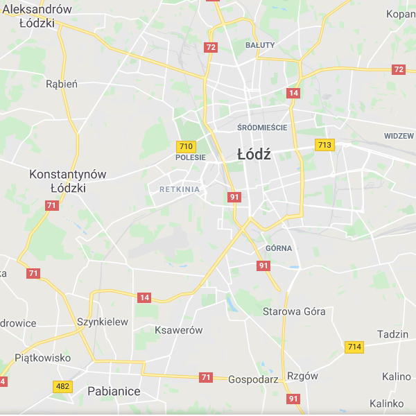
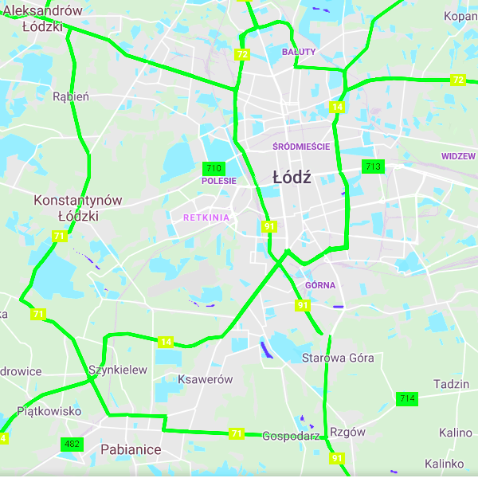
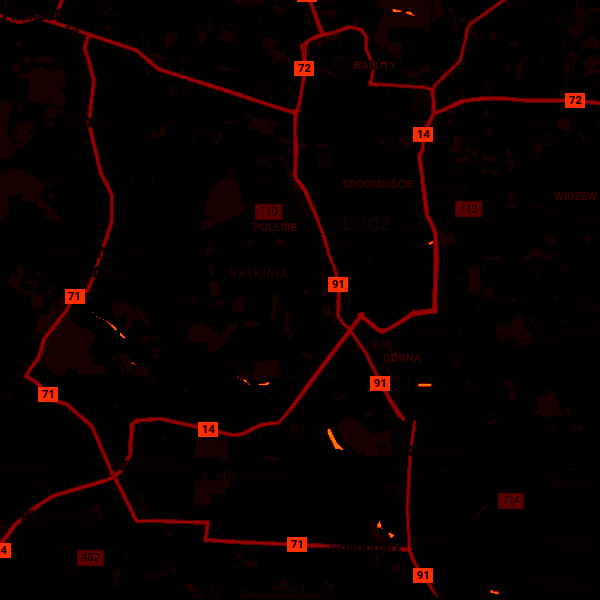

# colorimgdiff
[](https://travis-ci.com/Shot511/colorimgdiff) 
[](https://opensource.org/licenses/MIT)

An utility application to generate colored images (using colormaps) of difference between reference and source images.

## How to build
Simply run Cmake:
```
mkdir build
cd build
cmake ..
[optional] cmake --build .
```

## How to use
Available supported commands are being shown after executing ```colorimgdiff -h```:

```
Creates diff image of ref(erence) and src (source) images. It simply computes luma difference between ref and src.

Usage:
  colorimgdiff [OPTION...]

  -r, --ref arg       Relative path to reference image WITH extension
                      [REQUIRED]
  -s, --src arg       Relative path to source image WITH extension
                      [REQUIRED]
  -o, --out arg       Relative path to output image WITHOUT extension (it'll
                      be a PNG image) (default: output_diff)
  -c, --colormap arg  Changes the default colormap. Possible options are:
                      Parula, Heat, Hot, Jet, Gray, Magma, Inferno, Plasma,
                      Viridis, Cividis, Github. (default: Hot)
  -v, --verbose       Verbose output
  -h, --help          Prints this message
```

## Available Colormaps
See [tinycolormap](https://github.com/yuki-koyama/tinycolormap) repo for available colormaps or simply run ```colorimgdiff -h```.

## How it works
1) It loads ref and src images.
2) Computes grayscale images of ref and src.
3) Normalizes the grayscale images of ref and src to the range [0, 1].
4) Calculates image difference using grayscale images -> ```luma_ref - luma_src```.
5) Maps difference to a color based on a chosen colormap.
6) Outputs diff image.
7) If ```--verbose``` option was active it also prints out MSE and RMSE.

## Example

| Ref | Src | Diff |
|-----|-----|------|
|  |  |  |

## Dependencies
* [stb_image_write.h](https://github.com/nothings/stb) (PUBLIC DOMAIN)
* [stb_image.h](https://github.com/nothings/stb) (PUBLIC DOMAIN)
* [tinycolormap.hpp](https://github.com/yuki-koyama/tinycolormap) (MIT)
* [cxxopts.hpp](https://github.com/jarro2783/cxxopts) (MIT)

## Contribution
Pull requests are very welcome.